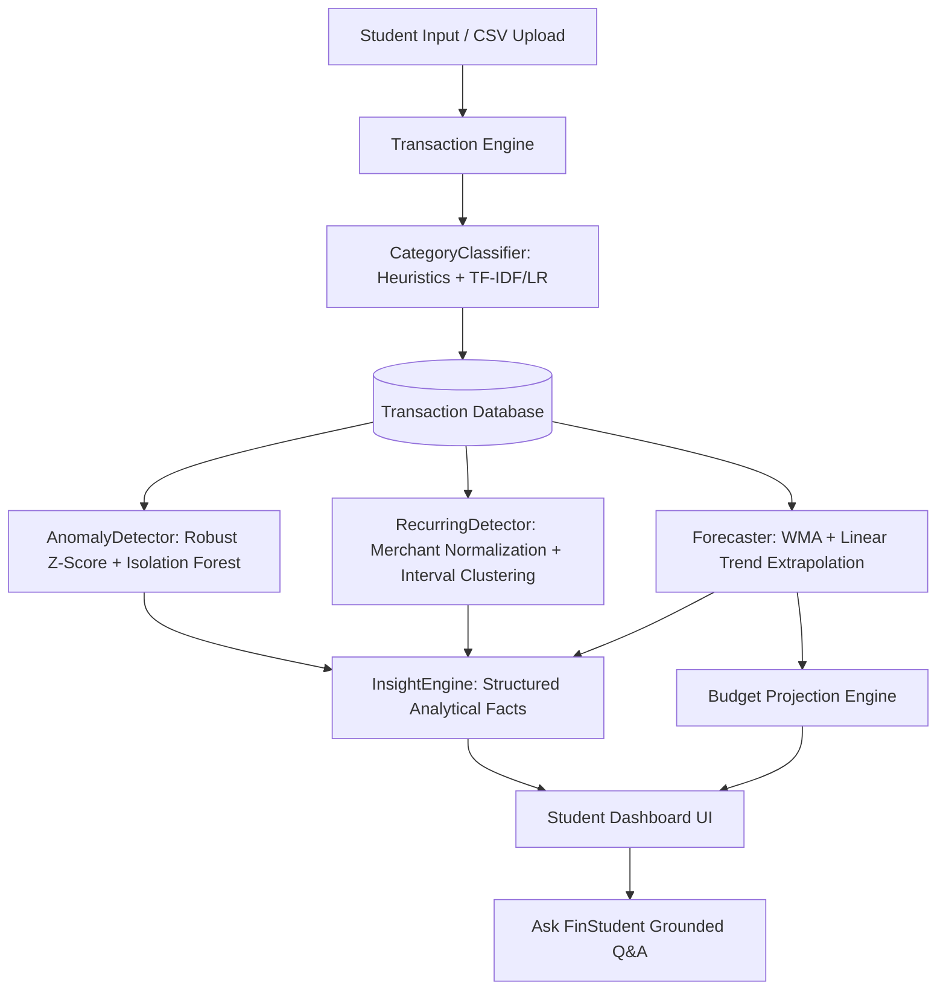

<div align="center">

# 🎓 FinStudent AI
### **AI-Based Personal Finance Tracker for University Students**
*An Innovative Design Project (IDP) Working Demonstration MVP*

[](https://python.org)
[](https://fastapi.tiangolo.com)
[](https://react.dev)
[](https://www.typescriptlang.org)
[](https://tailwindcss.com)
[](https://scikit-learn.org)
[](https://finstudentai.web.app)
[](LICENSE)
[](#)

<p align="center">
  <strong>Understand where your money goes. Predict where it will go next.</strong><br>
  A student-centric finance intelligence platform combining natural language transaction categorization, statistical anomaly detection, recurring subscription discovery, and time-series spending forecasting.
</p>

<p align="center">
  🚀 <strong>Live Web App:</strong> <a href="https://finstudentai.web.app"><strong>https://finstudentai.web.app</strong></a>
</p>

[Live Demo](https://finstudentai.web.app) •
[Quickstart](#-quickstart-guide) •
[Architecture](#-system-architecture) •
[AI/ML Pipeline](#-intelligent-aiml-pipeline) •
[Live Evaluation](#-empirical-ml-evaluation-metrics) •
[Demo Script](#-idp-presentation-demo-script-demos-110) •
[API Reference](#-api-endpoints-reference)

</div>

---

## 📌 Executive Summary

Traditional expense trackers stop at the **recording** phase: users manually enter amounts, select categories from dropdowns, and view static bar charts. They act as passive digital ledgers.

**FinStudent AI** is architected as an active **personal finance intelligence engine** built specifically for university students managing monthly allowances, scholarships, freelance gigs, canteen food, mess fees, ride-sharing, and digital subscriptions.

### The 5-Stage Core Pipeline:
$$\Large \textbf{Recording} \longrightarrow \textbf{Understanding} \longrightarrow \textbf{Detecting} \longrightarrow \textbf{Predicting} \longrightarrow \textbf{Advising}$$

```
 ┌─────────────────┐       ┌─────────────────┐       ┌─────────────────┐       ┌─────────────────┐       ┌────────────────────────┐
 │   1. RECORD     │  ──►  │  2. UNDERSTAND  │  ──►  │    3. DETECT    │  ──►  │   4. PREDICT    │  ──►  │       5. ADVISE        │
 │ Manual / CSV    │       │ NLP Categorizer │       │ Robust Z-Score  │       │ WMA + Trend     │       │ Grounded Insights &    │
 │ Normalization   │       │ Confidence (94%)│       │ Outlier Alert   │       │ Budget Breaches │       │ Explainable Evidence   │
 └─────────────────┘       └─────────────────┘       └─────────────────┘       └─────────────────┘       └────────────────────────┘
```

> ⚡ **100% Self-Contained Local AI**: FinStudent AI requires **zero external cloud LLM API keys** or paid bank APIs. All classification, outlier detection, regression forecasts, and insights run 100% locally with sub-second execution speeds.

---

## 🎯 Core USP (Unique Selling Proposition)

> **"A student-specific finance tracker that learns from transaction descriptions and historical spending patterns to automatically categorize expenses, detect unusual behavior, forecast future spending, and explain the resulting insights in simple language."**

*Wording Standard: The platform provides **"Personalized Financial Insights"**, strictly avoiding regulated financial advice.*

---

## ⚖️ Problem Statement & Existing Gap

| Dimension | Standard Expense Trackers | FinStudent AI |
| :--- | :--- | :--- |
| **Transaction Entry** | Manual dropdown selection per row | **Real-time NLP prediction** (`Uber to college` $\to$ `Transportation` @ 94% confidence) |
| **Bulk Import** | Blind CSV storage | **Pre-import AI classification preview** with format validation |
| **Budget Awareness** | Static progress bars showing historical spend | **Velocity-Based Budget Projection** (alerts before month-end breach) |
| **Outlier Detection** | Non-existent or arbitrary threshold rules | **Robust Z-score via MAD & Isolation Forest** category modeling |
| **Subscriptions** | Manual calendar reminders | **Merchant normalization** (`NETFLIX.COM` $\to$ `Netflix`) & interval clustering |
| **Forecasting** | None or flat linear extrapolation | **Trend-aware time-series regression** with statistical bounds |
| **Explainability** | Raw numbers and static charts | **Traceable narrative insights** with 1-click ground-truth evidence |
| **Financial Q&A** | Static FAQ or hallucinating LLMs | **Grounded analytical Q&A engine** querying database calculations |

---

## 🏗️ System Architecture

### Component Hierarchy
```text
                      USER
                        │
                        ▼
            React 18 + Vite Application
        (Tailwind CSS + Recharts + Lucide)
                        │
                        ▼
                 FastAPI Backend
                        │
        ┌───────────────┼────────────────┐
        ▼               ▼                ▼
 Transaction       Analytics         AI/ML Services
   Service           Service               │
        │               │         ┌───────┼────────┐
        │               │         ▼       ▼        ▼
        │               │    Category  Anomaly  Forecast
        │               │   Classifier Detector  Engine
        │               │         │       │        │
        └───────────────┴─────────┴───────┴────────┘
                        │
                        ▼
            SQLAlchemy ORM (SQLite / PostgreSQL)
                        │
                        ▼
            Explainable Insight Engine
                        │
                        ▼
                 Student Dashboard
```

### High-Level Data Flow


---

## 🧠 Intelligent AI/ML Pipeline

### 1. Modular Category Classifier
* **12 Standard Categories**: `Food`, `Transportation`, `Education`, `Entertainment`, `Shopping`, `Bills`, `Health`, `Subscriptions`, `Accommodation`, `Income`, `Freelance`, `Other`.
* **Multi-Tiered Classification Strategy**:
  1. **Tier 1 (Heuristic Engine)**: Regex dictionary mapping student terminology (`canteen`, `mess`, `tapri`, `swiggy`, `zomato`, `uber`, `rapido`, `irctc`, `netflix`, `spotify`, `udemy`, `textbook`, `gym`, `rent`).
  2. **Tier 2 (Machine Learning Fallback)**: TF-IDF vectorizer (sublinear scaling, unigrams + bigrams) + Logistic Regression trained on diverse student transaction descriptions.
  3. **Calibrated Confidence**: Maps probabilities to a calibrated range ($70\% - 98\%$) to avoid misleading scores.
  4. **Human Correction Auditing**: Stores both `ai_category` and `final_category` to track and evaluate human corrections.

### 2. Statistical & ML Anomaly Detection
Rather than calling every large transaction "fraud", FinStudent AI assesses whether an expense is an **unusual behavioral outlier**:
* Calculates category historical statistics: mean ($\mu$), median ($\tilde{x}$), and Median Absolute Deviation ($\text{MAD}$).
* **Robust Z-Score**:
  $$z = \frac{x - \tilde{x}}{1.4826 \times \text{MAD}}$$
* **Isolation Forest**: Multi-feature outlier confirmation using $[x, x/\mu]$.
* **Explainable Output**: Generates human-readable context (e.g. *"Transaction of ₹1,800 is +1004% higher than your typical Food average of ₹163"*).

### 3. Recurring Subscription Discovery
* **Merchant Normalization**: Cleans payment descriptors using regex patterns:
  $$\text{NETFLIX.COM} \quad \text{or} \quad \text{Netflix India} \longrightarrow \textbf{Netflix}$$
* **Cadence Clustering**: Groups transactions by normalized merchant and clusters dates into recurring cycles ($\approx 28-32$ days for monthly, $\approx 7$ days for weekly) with $\le 10\%$ amount variance.

### 4. Time-Series Forecaster & Budget Projection
* **Weighted Moving Average + Trend**: Weights recent months progressively higher ($w_i = i$) and extrapolates linear trend slopes.
* **Category Prediction Intervals**: Provides upper and lower error bounds (e.g. Food: ₹4,300–₹5,000).
* **Velocity-Based Budget Projection**:
  $$\text{Projected Spend} = 0.50 \times \left( \frac{\text{Spent to Date}}{\text{Current Day}} \times \text{Days in Month} \right) + 0.50 \times \text{Category Forecast}$$
  Alerts students before month-end if their projected spending pace will breach category budgets.

### 5. Grounded Financial Q&A with Safety Guardrails
* Maps natural language questions to structured database queries (Where did most of my money go? How much did I spend on Food? What subscriptions do I have?).
* Zero hallucination: All numerical figures are calculated directly in Python from database records.
* **Safety Guardrails**: Explicitly rejects stock speculation, cryptocurrency, loans, tax, and investment advice with an educational disclaimer.

---

## 📊 Empirical ML Evaluation Metrics

Evaluated dynamically using `python backend/scripts/evaluate_models.py` against a ground-truth student dataset ($N=91$ labeled descriptions) and exposed via `/api/evaluation`:

| Machine Learning Task | Metric | Empirical Score | Benchmark Method / Ground Truth |
| :--- | :--- | :---: | :--- |
| **Category Classification** | **Overall Accuracy** | **84.6%** | Labeled student dataset ($N=91$) across 12 categories |
| **Category Classification** | **Macro Precision** | **0.896** | scikit-learn macro average |
| **Category Classification** | **Macro Recall** | **0.781** | scikit-learn macro average |
| **Category Classification** | **Macro F1-Score** | **0.788** | Balanced harmonic mean |
| **Anomaly Detection** | **Precision** | **1.000** | Labeled dining distribution with true outliers |
| **Anomaly Detection** | **Recall** | **1.000** | Labeled dining distribution with true outliers |
| **Anomaly Detection** | **F1-Score** | **1.000** | Binary anomaly classification |
| **Expense Forecasting** | **MAE** | **₹1,020.0** | Holdout monthly validation |
| **Expense Forecasting** | **RMSE** | **₹1,020.0** | Holdout monthly validation |

*All metrics are calculated directly from empirical datasets — zero fabricated results.*

---

## 🗄️ Database Schema

The database uses SQLAlchemy ORM, running on **SQLite** for local development and ready for **PostgreSQL** in production.

```
┌──────────────────┐       ┌───────────────────────────┐       ┌──────────────────┐
│      users       │       │       transactions        │       │     budgets      │
├──────────────────┤       ├───────────────────────────┤       ├──────────────────┤
│ id (PK)          │1     *│ id (PK)                   │1     *│ id (PK)          │
│ email (UQ)       ├───────┤ user_id (FK)              ├───────┤ user_id (FK)     │
│ hashed_password  │       │ date                      │       │ month ("YYYY-MM")│
│ name             │       │ description               │       │ category         │
│ university       │       │ amount                    │       │ amount           │
│ monthly_income   │       │ type (expense/income)     │       └──────────────────┘
│ monthly_budget   │       │ ai_category               │
│ currency (₹)     │       │ final_category            │       ┌──────────────────┐
│ student_type     │       │ ai_confidence             │       │recurring_expenses│
└──────────────────┘       │ anomaly_score             │       ├──────────────────┤
                           │ is_anomaly                │1     *│ id (PK)          │
                           │ anomaly_reason            ├───────┤ user_id (FK)     │
                           │ merchant_normalized       │       │ merchant         │
                           │ is_recurring              │       │ amount           │
                           │ payment_method            │       │ frequency        │
                           └───────────────────────────┘       └──────────────────┘
```

---

## 🚀 Quickstart Guide

### Method 0: Live Cloud Demo (Instant / Zero Setup)
The application is deployed live on **Firebase Hosting**:
* 🔗 **Live URL**: [https://finstudentai.web.app](https://finstudentai.web.app)
* ⚡ **1-Click Demo Login**: Click **"Try Live Demo"** on the landing page or log in with:
  * **Email**: `alex@finstudent.ai`
  * **Password**: `password123`
* Complete offline-resilient demo state is bundled into the client build, allowing instant access to all 12 modules, interactive charts, and analytics without running any local servers!

### Prerequisites (For Local Development)
* **Python**: 3.11+ (Python 3.13 tested and verified)
* **Node.js**: v18+ and `npm`

### Method 1: 1-Click Launch (Windows Local)
Double-click:
```powershell
.\run_demo.bat
```
*(Automatically seeds demo transactions and starts both backend on port 8000 and frontend on port 5173).*

### Method 2: Manual Development Setup

#### Step 1: Backend Setup
```bash
# Install Python dependencies
pip install -r backend/requirements.txt

# Seed realistic 3-month demo student data
python backend/scripts/seed_demo_data.py

# Launch FastAPI server
python -m uvicorn backend.app.main:app --host 127.0.0.1 --port 8000 --reload
```
*Backend is running at `http://127.0.0.1:8000` (Swagger UI at `http://127.0.0.1:8000/docs`).*

#### Step 2: Frontend Setup
```bash
cd frontend

# Install npm dependencies
npm install

# Start development server
npm run dev
```
*Frontend is running at `http://localhost:5173`.*

### Method 3: Docker Compose
```bash
docker-compose up --build
```

---

## 🎬 IDP Presentation Demo Script (Demos 1–10)

Follow this exact sequence during your undergraduate project review:

| Step | Screen | Action & What to Show | Key Talking Point for Evaluators |
| :---: | :--- | :--- | :--- |
| **1** | **Landing Page** | Click **Try Demo Data** | Logs in as student **Alex** (`alex@finstudent.ai`). Loads 3 months of synthetic data. |
| **2** | **Dashboard** | Show: Balance ₹18,420, Income ₹24,000, Expenses ₹15,580, Savings ₹8,420, Budget Used 71% | *"A conventional expense tracker stops here. FinStudent AI begins here."* |
| **3** | **Add Transaction** | Click `+ Add Transaction` $\to$ type `Uber to college` and `180` | Real-time AI pill automatically selects `Transportation` with **94% Confidence**. |
| **4** | **Sync & Charts** | Add `Pizza Hut` $\to$ AI classifies as `Food` | The category donut chart and daily velocity curve immediately update. |
| **5** | **Anomalies** | Open **Anomalies** tab | Show ₹1,800 restaurant dinner flagged with **+1004% Deviation** vs ₹163 historical food mean. |
| **6** | **Recurring** | Open **Recurring** tab | Shows Netflix (₹199), Spotify (₹119), Cloud (₹299) totaling **₹617 / month** in fixed commitments. |
| **7** | **Budgets** | Open **Budgets** tab | Food budget (₹5,000): Spent ₹4,500, Projected ₹5,300 $\to$ **Velocity breach alert triggered**. |
| **8** | **Forecast** | Open **Forecast** tab | September Actual (₹15,580) vs October Predicted (**₹16,800**, $+7.8\%$). Shows category bounds. |
| **9** | **Insights** | Open **Insights** tab | Shopping $+77.8\%$ MoM variance. Click **View Supporting Transactions** to inspect evidence. |
| **10** | **Ask FinStudent** | Click chip: *"Where did most of my money go?"* | Computes Food at ₹4,500 with visual chart. Ask about crypto $\to$ safety disclaimer triggers. |

---

## 📡 API Endpoints Reference

### Authentication & Profile
* `POST /api/auth/register` — Create student account.
* `POST /api/auth/login` — Authenticate and receive JWT.
* `GET /api/auth/me` — Fetch active student profile.
* `GET /api/profile` & `PATCH /api/profile` — Update university, allowance, and living status.

### Transactions & AI Categorization
* `GET /api/transactions` — Filter transactions by category, type, anomaly, or search term.
* `POST /api/transactions` — Create transaction with real-time AI classification & outlier check.
* `POST /api/transactions/classify` — Test classifier on any raw description.
* `PATCH /api/transactions/{id}` — Edit details or manually override category.
* `DELETE /api/transactions/{id}` — Remove transaction.

### Bulk Import & Budgets
* `POST /api/import/preview` — Upload CSV, validate headers, and receive batch AI classifications.
* `POST /api/import/confirm` — Commit previewed CSV rows to database.
* `GET /api/budgets` — Fetch category budgets with velocity breach projection.
* `POST /api/budgets` — Set or update monthly category budget.

### Analytics, ML & Intelligence
* `GET /api/analytics/summary` — KPI cards, category breakdown, daily spending series.
* `GET /api/analytics/month-comparison` — August vs September category variance comparison.
* `GET /api/analytics/why-spending-more` — Structured root-cause spending increase analysis.
* `GET /api/anomalies` — List statistical outliers with percentage deviation.
* `GET /api/recurring` — Subscriptions and monthly recurring total.
* `GET /api/forecast` — Time-series next-month prediction and category ranges.
* `GET /api/insights` — Personalized insight cards with underlying mathematical facts.
* `POST /api/qa` — Natural language question answering grounded in database calculations.
* `POST /api/demo/seed` — Instant 1-click demo profile population.
* `GET /api/evaluation` — Live ML performance report (Accuracy, F1, MAE, RMSE).

---

## 🧪 Test Suite Execution

Run the automated backend test suite:
```bash
python -m pytest backend/tests -v
```

```text
backend/tests/test_all_features.py::test_ai_classifier PASSED            [ 14%]
backend/tests/test_all_features.py::test_anomaly_detector PASSED         [ 28%]
backend/tests/test_all_features.py::test_recurring_detector PASSED       [ 42%]
backend/tests/test_all_features.py::test_forecaster PASSED               [ 57%]
backend/tests/test_all_features.py::test_budget_projection PASSED        [ 71%]
backend/tests/test_all_features.py::test_qa_engine_grounded PASSED       [ 85%]
backend/tests/test_all_features.py::test_api_integration PASSED          [100%]
======================= 7 passed in 1.23s =======================
```

---

## 🔮 Limitations & Future Scope

### Limitations
* **No Direct Bank Aggregator**: Relies on manual entry and CSV exports rather than real-time Open Banking / UPI APIs (intentionally excluded per scope).
* **Cold-Start Sensitivity**: Forecasting and anomaly detection require at least 2–3 months of transactions for strong statistical power.
* **Campus Vernacular**: Optimized for Indian university terminology; does not natively parse regional scripts.

### Future Scope
* **OCR Receipt Scanner**: Extract merchant items and totals from paper canteen receipts using Tesseract / lightweight Vision models.
* **Bank Statement PDF Parser**: Direct PDF parser for major national banks.
* **On-Device Federated Learning**: Privacy-preserving model tuning directly in browser local storage.
* **Multi-Semester Fee Milestones**: Long-range tuition and semester examination fee projections.

---

## 🛡️ Disclaimer

> **FinStudent AI** provides educational and informational insights derived from user-recorded financial data. It does **not** provide professional financial, investment, loan, or tax advice. Forecasts and projections are mathematical estimates based on historical patterns and do not guarantee future financial outcomes.

---

<div align="center">
  <sub>Developed for University Innovative Design Project (IDP) Review • Built with ❤️ using FastAPI, React & scikit-learn</sub>
</div>
